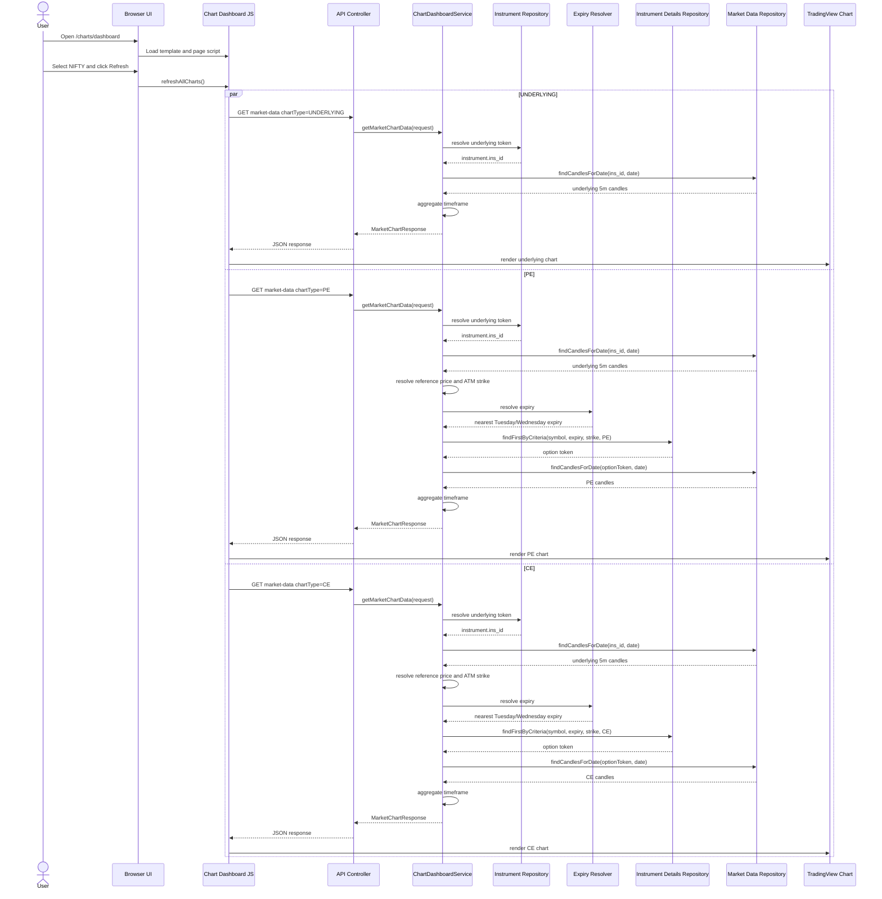

# Chart Dashboard

Technical walkthrough of the Zerodha Kite-style chart dashboard implementation.

Routes:

- Page: `GET /charts/dashboard`
- API: `GET /api/charts/market-data`

---

## Overview

The chart dashboard is a server-rendered Thymeleaf page backed by a REST API.

When the user selects:

- a trading date
- an index: `NIFTY` or `BANKNIFTY`
- one or more timeframes: `5m`, `10m`, `15m`
- one or more SMA periods: `20`, `50`, `100`, `200`, `500`

the frontend requests chart data separately for:

- the underlying index
- the ATM PE option
- the ATM CE option

The dashboard supports two data sources:

- `TOKEN_BASED`: existing `market_data` plus token metadata
- `HISTORICAL_ICICI`: imported ICICI CSV data in `historical_spot_candles` and `historical_option_candles`

Both data sources start from 5-minute candles. `10m` and `15m` are aggregated
from those 5-minute rows.

For the historical ICICI storage/import design, see
[`HISTORICAL_CHART_DATA_PLAN.md`](HISTORICAL_CHART_DATA_PLAN.md).

SMA overlays are computed at runtime from 5-minute candle closes using prior-day
lookback candles, then projected onto aggregated `10m` and `15m` buckets by
carrying forward the last available 5-minute SMA inside each bucket.

---

## Frontend Flow

### Page entry

- `GET /charts/dashboard` is handled by `ChartDashboardViewController`
- the controller returns the Thymeleaf template `chart-dashboard`
- the page HTML lives in `src/main/resources/templates/chart-dashboard.html`

### UI structure

The template contains:

- date picker: `chartDate`
- previous / next / today date shortcuts: `prevDateBtn`, `nextDateBtn`, `todayDateBtn`
- data source dropdown: `chartDataSource`
- index dropdown: `chartIndexSymbol`
- timeframe chip group: `chartTimeframes`
- SMA chip group: `chartSmaPeriods`
- refresh button: `refreshChartsBtn`
- fullscreen toggle: `fullscreenChartsBtn`

Three panes are rendered:

- left: `pePane`
- center: `underlyingPane`
- right: `cePane`

Each pane has:

- metadata placeholders
- timeframe tabs container
- loading state
- error state
- no-data state
- chart container

### JavaScript responsibilities

`src/main/resources/static/js/chart-dashboard.js` handles:

- default control values
- localStorage persistence for the last-used date, source, index, timeframe,
  SMA, and active timeframe
- reading filter values
- reacting to filter changes
- previous / next / today date navigation
- chip-style timeframe and SMA toggles
- refresh button clicks
- keyboard shortcuts for date stepping, refresh, active timeframe, and exiting
  fullscreen mode
- API calls
- timeframe tab switching
- loading, error, and no-data states
- TradingView `lightweight-charts` rendering

### What happens when the user selects NIFTY and refreshes

The page state is read from the controls:

- `date`
- `dataSource = HISTORICAL_ICICI` or `TOKEN_BASED`
- `indexSymbol = NIFTY`
- selected timeframes
- selected SMA periods

Then the script triggers three backend fetch groups:

- `chartType=PE`
- `chartType=UNDERLYING`
- `chartType=CE`

For each selected timeframe, one request is sent per chart type.

Example for `date=2024-06-06`, `timeframe=5m`, `smaPeriods=20,50,100,200,500`:

- `GET /api/charts/market-data?date=2024-06-06&dataSource=HISTORICAL_ICICI&indexSymbol=NIFTY&chartType=UNDERLYING&timeframe=5m&smaPeriods=20,50,100,200,500`
- `GET /api/charts/market-data?date=2024-06-06&dataSource=HISTORICAL_ICICI&indexSymbol=NIFTY&chartType=PE&timeframe=5m&smaPeriods=20,50,100,200,500`
- `GET /api/charts/market-data?date=2024-06-06&dataSource=HISTORICAL_ICICI&indexSymbol=NIFTY&chartType=CE&timeframe=5m&smaPeriods=20,50,100,200,500`

If the user selects multiple timeframes, the frontend sends one API call per
timeframe per chart type.

Example for `5m,10m,15m`:

- 3 requests for UNDERLYING
- 3 requests for PE
- 3 requests for CE

Total: 9 requests

### Timeframe handling

Responses are stored by chart type and timeframe.

Only one timeframe is displayed at a time. The active timeframe tab controls
which response is rendered in each pane.

### SMA handling

The frontend sends the selected SMA list to the backend as `smaPeriods`, but
the backend response still includes all SMA fields.

The selected SMA list is used on the frontend to decide which overlays to draw:

- `20 -> sma20`
- `50 -> sma50`
- `100 -> sma100`
- `200 -> sma200`
- `500 -> sma500`

### Chart rendering

The page uses TradingView `lightweight-charts` from CDN.

Candles are mapped as:

- `time`
- `open`
- `high`
- `low`
- `close`

SMA overlays are mapped to line series. Null SMA values are skipped.

The script also:

- destroys old chart instances before re-rendering
- resizes charts responsively
- falls back to a summary placeholder if chart rendering fails

### UI states

Per pane:

- loading is shown while requests are in flight
- error is shown if the request fails
- no-data is shown if the API returns an empty `data` array

---

## Backend API Flow

### Controller

`GET /api/charts/market-data` is handled by:

- `src/main/java/com/moneymaker/chart/controller/ChartDashboardApiController.java`

### Request parameter mapping

The controller receives:

- `date`
- `dataSource`
- `indexSymbol`
- `chartType`
- `timeframe`
- `smaPeriods`

It converts them into `MarketChartRequest`:

- `date -> LocalDate`
- `dataSource -> ChartDataSource`
- `indexSymbol -> IndexSymbol`
- `chartType -> ChartType`
- `timeframe -> ChartTimeframe`
- `smaPeriods -> List<Integer>`

### DTOs used

- `MarketChartRequest`
- `MarketChartResponse`
- `ChartCandleResponse`
- `ChartType`
- `IndexSymbol`
- `ChartTimeframe`

### Validation

`ChartDashboardService` validates:

- request is present
- `date` is present
- `indexSymbol` is present
- `chartType` is present
- `timeframe` is present
- `smaPeriods` is present
- all SMA periods are from `20,50,100,200,500`

### Response behavior

Success:

- HTTP `200`
- `MarketChartResponse`

No data:

- HTTP `200`
- same response shape
- `data: []`

Invalid request:

- HTTP `400`
- body like `{ "error": "..." }`

---

## Underlying Chart Flow

When `chartType = UNDERLYING`:

1. resolve the underlying instrument from `instrument`
2. read the underlying token from `instrument.ins_id`
3. query `market_data` for that token and selected date
4. map each `MarketData` row to `ChartCandleResponse`
5. compute runtime SMA values from 5-minute closes using prior-day lookback
6. apply timeframe aggregation
7. return `MarketChartResponse`

### Underlying token resolution

Repository:

- `InstrumentRepository`

Lookup order:

1. exact `ins_name = NIFTY` or `BANKNIFTY`
2. fallback prefix match like `NIFTY%` or `BANKNIFTY%`

Fields used from `instrument`:

- `ins_name`
- `ins_id`

### Candle query

Repository:

- `MarketDataRepository.findCandlesForDate(instrumentToken, tradingDate)`

Query rules:

- `instrumenttoken = :instrumentToken`
- `DATE(timestamp) = :tradingDate`
- ordered by `timestamp ASC`

### Timeframe behavior

- `5m`: returned as-is after sort
- `10m`: grouped into consecutive 2-candle buckets
- `15m`: grouped into consecutive 3-candle buckets

Aggregation rules:

- open = first candle open
- high = max high
- low = min low
- close = last candle close
- SMA fields = last non-null runtime 5-minute SMA in the bucket

### SMA mapping

- `sma20` is computed from 5-minute closes with period `20`
- `sma50` is computed from 5-minute closes with period `50`
- `sma100` is computed from 5-minute closes with period `100`
- `sma200` is computed from 5-minute closes with period `200`
- `sma500` is computed from 5-minute closes with period `500`

Lookback candles from prior trading dates are included so the selected day can
show SMA values from its opening candles when enough history exists.

### Response

For underlying charts:

- `expiryDate = null`
- `atmStrike = null`

The logic is the same for `NIFTY` and `BANKNIFTY`; only the underlying
instrument lookup label differs.

---

## ATM PE and ATM CE Flow

When `chartType = PE` or `chartType = CE`:

1. resolve the underlying token
2. fetch underlying 5-minute candles for the selected date
3. choose a reference price
4. calculate the ATM strike
5. resolve the weekly expiry
6. resolve the option token from `instrument_details`
7. fetch option candles from `market_data`
8. compute runtime SMA values from 5-minute closes using prior-day lookback
9. aggregate by requested timeframe
10. return chart data

### Reference price

The service chooses:

1. the first available candle close at or after market open (`09:15`)
2. if unavailable, the first non-null close for that date

### ATM strike

- `NIFTY -> nearest 50`
- `BANKNIFTY -> nearest 100`

### Expiry resolution

Table:

- `expiry_dates`

Current resolver behavior:

- reads all expiry rows where `expiry_date >= selectedDate`
- filters in memory by weekday

Rules:

- `NIFTY -> Tuesday`
- `BANKNIFTY -> Wednesday`

Nearest matching expiry is returned.

### Option token resolution

Table:

- `instrument_details`

Repository criteria:

- trading symbol starts with selected index symbol
- `expiry = resolved expiry date`
- `strike = atmStrike`
- `instrument_type = CE` or `PE`

Fields required:

- `tradingsymbol`
- `expiry`
- `strike`
- `instrument_type`
- `instrument_token`

`name` exists in the entity but is not used by the chart flow.

### Option candle fetch

After token resolution, the option token is queried in `market_data` using the
same date filter as the underlying chart.

### Missing-data behavior

If underlying token is missing:

- return safe empty response

If underlying candles are missing:

- return safe empty response

If reference price cannot be found:

- return safe empty response

If expiry is missing:

- return safe empty response
- include `atmStrike` if it was calculated

If option token is missing:

- return safe empty response
- include `expiryDate` and `atmStrike`

If option candles are missing:

- return response with `data: []`

The only logic difference between `NIFTY` and `BANKNIFTY` is:

- ATM rounding step
- expiry weekday

---

## Required Tables

| Table | Purpose | Required columns | Used for | If missing |
|---|---|---|---|---|
| `market_data` | stores 5-minute candles | `instrumenttoken`, `timestamp`, `open`, `high`, `low`, `close` | UNDERLYING, PE, CE | chart returns empty data |
| `instrument` | resolves underlying token | `ins_name`, `ins_id` | UNDERLYING, PE, CE | underlying and option flows cannot start |
| `instrument_details` | resolves CE/PE option token | `tradingsymbol`, `expiry`, `strike`, `instrument_type`, `instrument_token` | PE, CE | option flow returns empty data |
| `expiry_dates` | resolves nearest weekly expiry | `expiry_date` | PE, CE | option flow returns empty data |

### market_data

This table stores 5-minute base candle data.

Columns used by the dashboard:

- `id`
- `close`
- `high`
- `instrumenttoken`
- `low`
- `open`
- `timestamp`

The table may also contain `sma_value20`, `sma_value50`, `sma_value100`,
`sma_value200`, and `sma_value500`, but the chart dashboard does not rely on
those stored values for plotting. It computes SMA at runtime from candle close
prices.

### instrument

Used to resolve the underlying token for:

- `NIFTY`
- `BANKNIFTY`

Current code uses:

- `ins_name`
- `ins_id`

### instrument_details

Used to resolve the ATM option token for:

- CE
- PE

Current code uses:

- `tradingsymbol`
- `expiry`
- `strike`
- `instrument_type`
- `instrument_token`

### expiry_dates

Used to find the nearest valid weekly expiry date.

Current chart resolver uses:

- `expiry_date`

The entity also has `instrument_id`, but the current chart resolver does not
use it yet.

---

## Example End-to-End Flow

Example user selection:

- `date = 2024-06-06`
- `indexSymbol = NIFTY`
- `timeframe = 5m`
- `smaPeriods = 20,50,100,200,500`

Flow:

1. frontend sends UNDERLYING request
2. backend resolves NIFTY underlying token from `instrument`
3. backend fetches NIFTY 5-minute candles from `market_data`
4. backend returns underlying candles
5. frontend sends PE request
6. backend resolves NIFTY underlying token
7. backend fetches underlying candles again
8. backend uses the first close at or after `09:15`
9. backend calculates NIFTY ATM strike using nearest `50`
10. backend resolves the nearest Tuesday expiry from `expiry_dates`
11. backend resolves the PE token from `instrument_details`
12. backend fetches PE candles from `market_data`
13. backend returns PE chart data
14. frontend sends CE request
15. backend resolves the CE token from `instrument_details`
16. backend fetches CE candles from `market_data`
17. backend returns CE chart data
18. frontend renders:
    - left = ATM PE
    - center = NIFTY
    - right = ATM CE

---

## Sequence Diagram

---

## Missing Data Checklist

- `instrument` contains valid underlying rows for `NIFTY` and `BANKNIFTY`
- `instrument.ins_id` matches `market_data.instrumenttoken` for underlying rows
- `expiry_dates` contains required Tuesday and Wednesday expiries
- `instrument_details` contains CE/PE rows with matching:
  - symbol prefix
  - expiry
  - strike
  - option type
  - instrument token
- `market_data` contains 5-minute candles for:
  - underlying token
  - PE token
  - CE token
- enough historical 5-minute candles exist before the selected date so larger
  SMA periods such as `200` and `500` can be computed from lookback history

---

## Debugging Guide

If a pane shows no data, check:

1. does `market_data` contain rows for the selected date
2. does the UNDERLYING API call return candles
3. does `instrument` resolve the underlying token
4. does `expiry_dates` contain the nearest valid weekly expiry
5. does the calculated ATM strike match `instrument_details.strike`
6. does `instrument_details` contain the CE/PE token
7. does `market_data` contain CE/PE candles for that token
8. is the frontend sending `date` as `yyyy-MM-dd`
9. are there browser console errors
10. did the TradingView `lightweight-charts` CDN load successfully

---

## Current Notes

- The backend API is safe by default: missing lookup data returns empty results
  instead of throwing a chart-breaking error.
- `expiry_dates.instrument_id` exists in the entity, but the current chart
  expiry resolver uses weekday filtering on `expiry_date` only.
