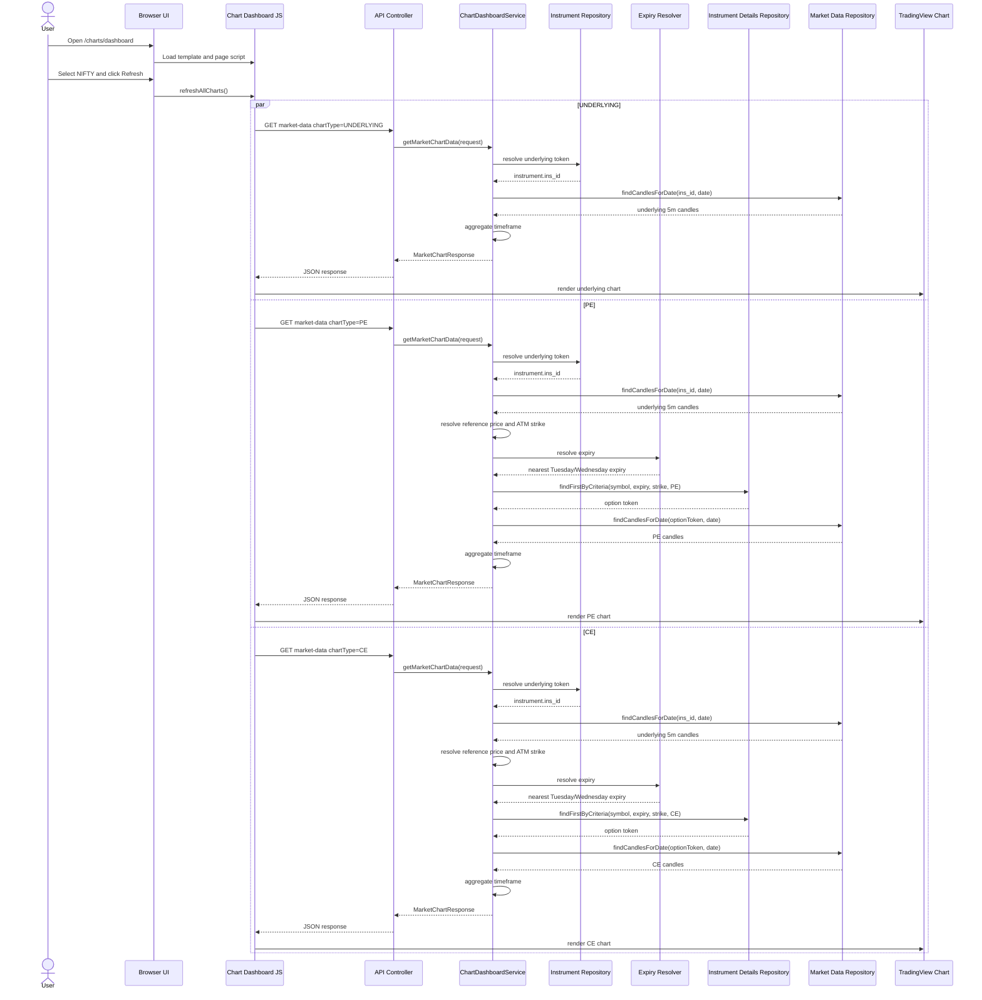

# Chart Dashboard

Technical walkthrough of the Zerodha Kite-style chart dashboard implementation.

Routes:

- Page: `GET /charts/dashboard`
- API: `GET /api/charts/market-data`

---

## Overview

The chart dashboard is a server-rendered Thymeleaf page backed by a REST API.

When the user selects:

- a trading date
- an index: `NIFTY` or `BANKNIFTY`
- one or more timeframes: `5m`, `10m`, `15m`
- one or more SMA periods: `20`, `50`, `100`, `200`, `500`

the frontend requests chart data separately for:

- the underlying index
- the ATM PE option
- the ATM CE option

The dashboard supports two data sources:

- `TOKEN_BASED`: existing `market_data` plus token metadata
- `HISTORICAL_ICICI`: imported ICICI CSV data in `historical_spot_candles` and `historical_option_candles`

Both data sources start from 5-minute candles. `10m` and `15m` are aggregated
from those 5-minute rows.

For the historical ICICI storage/import design, see
[`HISTORICAL_CHART_DATA_PLAN.md`](HISTORICAL_CHART_DATA_PLAN.md).

Overlays are computed at runtime by `ChartIndicatorService`, on the **aggregated**
series, using prior-day lookback candles to warm up:

- **Paired SMA over low and high.** Each period yields `sma{N}Low` and
  `sma{N}High` — there is no close-based SMA. The low series is the one the
  trading strategy gates on (`SMAIndicatorImpl` averages candle lows
  deliberately), so the chart and the strategy now agree.
- **SuperTrend(7, 3)** — ATR period 7, band multiplier 3, Wilder-smoothed ATR.
  Emitted as `supertrend` plus a `supertrendUp` direction flag.

> **Order changed:** indicators used to be computed on the 5-minute series and
> then carried through aggregation buckets, which meant "SMA20" on the 15m chart
> was really a 100-minute average. Now the series is aggregated *first* and
> indicators are computed on the bars actually drawn. SuperTrend requires this —
> it is path-dependent (its band ratchets and its direction flips off the previous
> bar) so it cannot be down-sampled after the fact.

---

## Frontend Flow

### Page entry

- `GET /charts/dashboard` is handled by `ChartDashboardViewController`
- the controller returns the Thymeleaf template `chart-dashboard`
- the page HTML lives in `src/main/resources/templates/chart-dashboard.html`

### UI structure

The template contains:

- date picker: `chartDate`
- previous / next / today date shortcuts: `prevDateBtn`, `nextDateBtn`, `todayDateBtn`
- data source dropdown: `chartDataSource`
- index dropdown: `chartIndexSymbol`
- timeframe chip group: `chartTimeframes`
- SMA chip group: `chartSmaPeriods`
- strike select: `chartStrike`
- overlay toggle chips: `chartOverlays` (`SMA High`, `SuperTrend`)
- refresh button: `refreshChartsBtn`
- fullscreen toggle: `fullscreenChartsBtn`

Three panes are rendered across two rows — the index chart spans the full width
on top, the two option charts share the row beneath it:

- row 1, full width: `underlyingPane`
- row 2, left: `pePane`
- row 2, right: `cePane`

DOM order matches (underlying, PE, CE) so tab order follows the visual order.
The toolbar is a flex row, not a fixed grid: a fixed `grid-template-columns`
list has to be re-counted whenever a control is added, and adding the strike
picker to a six-track grid pushed Refresh onto its own row and split the SMA
chips over two lines.

Each pane has:

- metadata placeholders
- SMA legend container
- loading state
- error state
- no-data state
- chart container

### JavaScript responsibilities

`src/main/resources/static/js/chart-dashboard.js` handles:

- default control values
- localStorage persistence for the last-used date, source, index, timeframe,
  SMA, strike, overlay toggles, and active timeframe
- reading filter values
- reacting to filter changes
- previous / next / today date navigation
- single-select chip timeframes, multi-select chip SMA periods and overlays
- refresh button clicks
- keyboard shortcuts for date stepping, refresh, timeframe selection, dismissing
  a pinned readout, and exiting fullscreen mode
- API calls
- loading, error, and no-data states
- TradingView `lightweight-charts` rendering

### What happens when the user selects NIFTY and refreshes

The page state is read from the controls:

- `date`
- `dataSource = HISTORICAL_ICICI` or `TOKEN_BASED`
- `indexSymbol = NIFTY`
- selected timeframes
- selected SMA periods

Then the script triggers three backend fetch groups:

- `chartType=PE`
- `chartType=UNDERLYING`
- `chartType=CE`

For each selected timeframe, one request is sent per chart type.

Example for `date=2024-06-06`, `timeframe=5m`, `smaPeriods=20,50,100,200,500`:

- `GET /api/charts/market-data?date=2024-06-06&dataSource=HISTORICAL_ICICI&indexSymbol=NIFTY&chartType=UNDERLYING&timeframe=5m&smaPeriods=20,50,100,200,500`
- `GET /api/charts/market-data?date=2024-06-06&dataSource=HISTORICAL_ICICI&indexSymbol=NIFTY&chartType=PE&timeframe=5m&smaPeriods=20,50,100,200,500`
- `GET /api/charts/market-data?date=2024-06-06&dataSource=HISTORICAL_ICICI&indexSymbol=NIFTY&chartType=CE&timeframe=5m&smaPeriods=20,50,100,200,500`

If the user selects multiple timeframes, the frontend sends one API call per
timeframe per chart type.

Example for `5m,10m,15m`:

- 3 requests for UNDERLYING
- 3 requests for PE
- 3 requests for CE

Total: 9 requests

### Timeframe handling

Responses are stored by chart type and timeframe.

**Timeframes is single-select.** The chip group is bound with
`bindChipGroup(..., { single: true })`, so picking a chip clears its siblings and
re-clicking the active one is a no-op — deliberately, since re-selecting an
unchanged timeframe would otherwise fire a full nine-request refresh. Each
refresh therefore issues one request per pane rather than one per pane per
timeframe.

Only one timeframe is displayed at a time. There is no per-pane timeframe tab
strip — the toolbar chip group is the only timeframe control. (The strip existed
to switch between several loaded timeframes; single-select left it rendering one
always-active tab, so it was removed along with `renderTimeframeTabs()`.) Each
pane's header badge and its `Timeframe` meta field still show the current
choice.

Keyboard `1` / `2` / `3` select `5m` / `10m` / `15m` outright. (Before the group
became single-select these switched between the several loaded timeframes and
did nothing for one that was not selected.)

Sessions that predate single-select may still hold several values under
`mm.chartDashboard.timeframes`; `hydrateDefaults` keeps only the first so the
toolbar never restores multi-selected.

### SMA handling

The frontend sends the selected SMA list to the backend as `smaPeriods`, but
the backend response still includes all SMA fields.

The selected SMA list is used on the frontend to decide which overlays to draw.
Each period draws **two** lines, in one shared colour:

- `20 -> sma20Low` + `sma20High` — `#2f80ed`
- `50 -> sma50Low` + `sma50High` — `#27ae60`
- `100 -> sma100Low` + `sma100High` — `#f2994a`
- `200 -> sma200Low` + `sma200High` — `#eb5757`
- `500 -> sma500Low` + `sma500High` — `#6c5ce7`

### Overlay toggles

The `chartOverlays` chip group controls what is drawn on top of the candles.
Both chips are on by default, so the untouched chart is unchanged:

- **SMA High** — off hides the `sma{N}High` line of every selected period,
  leaving only `sma{N}Low`. The low line is never toggleable, because it is the
  series the strategy actually gates on. The legend suffix follows the state:
  `SMA 50 H/L` when on, `SMA 50 L` when off.
- **SuperTrend** — off hides both SuperTrend series and drops its legend entry.

Two behaviours differ from the other chip groups and are deliberate:

- The group may be emptied. `bindChipGroup` normally refuses to leave a group
  with nothing selected — meaningless for timeframes or SMA periods — so it
  takes an `allowEmpty` flag, and the overlays group reads through
  `getToggledValues` / `readStoredListAllowEmpty` rather than the helpers that
  substitute defaults for an empty list.
- Toggling redraws from `state.responses` via `renderVisiblePanes` instead of
  going through `refreshAllCharts`. Overlays are a pure render concern and every
  response already carries all the fields, so refetching would fire nine
  identical requests just to hide a line.

SuperTrend is not part of `smaPeriods`. It renders as two
line series — `#26a69a` for uptrend bars, `#ef5350` for downtrend bars, matching
the candle up/down colours — each carrying whitespace points for the other's
bars, so the pair reads as one line that changes colour at a flip. A single
`lightweight-charts` line series cannot change colour mid-series, hence the split.

### Chart rendering

The page uses TradingView `lightweight-charts` from CDN.

Candles are mapped as:

- `time`
- `open`
- `high`
- `low`
- `close`

SMA overlays are mapped to line series. Null SMA values are skipped.

The script also:

- destroys old chart instances before re-rendering
- resizes charts responsively
- falls back to a summary placeholder if chart rendering fails

### Click readout (pinned candle tooltip)

Clicking a candle pins a floating readout inside the pane, driven by
`chart.subscribeClick` in `attachCandleTooltip`:

- candle timestamp (IST, same formatter as the axis labels)
- `O` / `H` / `L` / `C`, with the close tinted green / red by close-vs-open
- absolute and percent change for the candle
- one row per selected SMA period, in the period's line colour:
  `L <sma low>` always, plus `H <sma high>` when the **SMA High** overlay is on
- a SuperTrend row (value + `UP` / `DOWN`) when the **SuperTrend** overlay is on

Dismiss a pin by clicking the same candle again, clicking empty plot area, or
pressing `Escape`. Escape is layered: it clears pinned readouts first and only
leaves fullscreen once none are left.

Each pane holds its own pin independently, so an underlying candle and its CE /
PE counterparts at the same timestamp can be read side by side.

The values come from the API payload looked up by click time, not from
`param.seriesData`. `seriesData` only carries series that were actually drawn,
so the SMA-high figures would disappear from the readout whenever the overlay
is off — but those are exactly the numbers worth reading.

The tooltip is `pointer-events: none`, so a pin sitting over the chart does not
block the click that would replace it, and it flips to the other side of the
click point near a pane edge because `.chart-canvas` clips its overflow. No
teardown hook is needed: the tooltip node is a child of the container
`renderChart` wipes, and the click subscription dies with the chart.

### UI states

Per pane:

- loading is shown while requests are in flight
- error is shown if the request fails
- no-data is shown if the API returns an empty `data` array

---

## Backend API Flow

### Controller

`GET /api/charts/market-data` is handled by:

- `src/main/java/com/moneymaker/chart/controller/ChartDashboardApiController.java`

### Request parameter mapping

The controller receives:

- `date`
- `dataSource`
- `indexSymbol`
- `chartType`
- `timeframe`
- `smaPeriods`
- `strike` (optional)

It converts them into `MarketChartRequest`:

- `date -> LocalDate`
- `dataSource -> ChartDataSource`
- `indexSymbol -> IndexSymbol`
- `chartType -> ChartType`
- `timeframe -> ChartTimeframe`
- `smaPeriods -> List<Integer>`
- `strike -> BigDecimal` (blank or `AUTO` becomes `null`)

### Strike selection

`strike` is optional. When absent the service resolves ATM from the day's
underlying price exactly as before, so the default behaviour is unchanged; when
present it charts that strike instead. `MarketChartResponse.atmStrike` always
reports the strike actually plotted, and the option pane headings switch from
`ATM PE` / `ATM CE` to `PE <strike>` / `CE <strike>` once a strike is picked.

`GET /api/charts/strikes?date=&indexSymbol=&chartType=&dataSource=` backs the
picker, returning `{expiryDate, atmStrike, strikes}`. The strikes come from the
same table the candles come from — `historical_option_candles` for
HISTORICAL_ICICI, `instrument_details` for TOKEN_BASED — so the picker can only
ever offer a strike that actually renders.

### DTOs used

- `MarketChartRequest`
- `MarketChartResponse`
- `ChartCandleResponse`
- `ChartType`
- `IndexSymbol`
- `ChartTimeframe`

### Validation

`ChartDashboardService` validates:

- request is present
- `date` is present
- `indexSymbol` is present
- `chartType` is present
- `timeframe` is present
- `smaPeriods` is present
- all SMA periods are from `20,50,100,200,500`

### Response behavior

Success:

- HTTP `200`
- `MarketChartResponse`

No data:

- HTTP `200`
- same response shape
- `data: []`

Invalid request:

- HTTP `400`
- body like `{ "error": "..." }`

---

## Underlying Chart Flow

When `chartType = UNDERLYING`:

1. resolve the underlying instrument from `instrument`
2. read the underlying token from `instrument.ins_id`
3. query `market_data` for that token and selected date
4. map each `MarketData` row to `ChartCandleResponse` (OHLC only)
5. apply timeframe aggregation over the whole lookback window
6. compute overlays on the aggregated series (`ChartIndicatorService`)
7. trim to the selected date and return `MarketChartResponse`

### Underlying token resolution

Repository:

- `InstrumentRepository`

Lookup order:

1. exact `ins_name = NIFTY` or `BANKNIFTY`
2. fallback prefix match like `NIFTY%` or `BANKNIFTY%`

Fields used from `instrument`:

- `ins_name`
- `ins_id`

### Candle query

Repository:

- `MarketDataRepository.findCandlesForDate(instrumentToken, tradingDate)`

Query rules:

- `instrumenttoken = :instrumentToken`
- `DATE(timestamp) = :tradingDate`
- ordered by `timestamp ASC`

### Timeframe behavior

- `5m`: returned as-is after sort
- `10m`: 10-minute buckets anchored on the 09:15 session open
- `15m`: 15-minute buckets anchored on the 09:15 session open

Aggregation rules:

- open = first candle open
- high = max high
- low = min low
- close = last candle close
- no indicator values are read or carried — overlays are computed afterwards

Buckets are keyed on `(trading date, elapsed minutes since the session open)`,
not on list position. Position-based chunking breaks once the input spans more
than one day: an NSE session is 75 five-minute candles, which is not divisible
by 2, so 10-minute buckets drift and eventually merge one day's last candle with
the next day's first. It also shifts every later bar whenever an illiquid option
series has a gap. Anchoring on the open puts boundaries where a broker puts them
(09:15, 09:30, …), and pre-open candles — the ICICI spot exports carry flat
09:05/09:10 rows — land in their own bucket instead of polluting the first
session bar.

### Indicator mapping

Computed by `ChartIndicatorService` on the aggregated series:

- `sma{N}Low` — mean of the last `N` candle **lows**
- `sma{N}High` — mean of the last `N` candle **highs**
- `supertrend` / `supertrendUp` — SuperTrend with ATR period `7` and multiplier
  `3`; ATR uses Wilder smoothing seeded from a simple mean of the first 7 true
  ranges, and the bands ratchet in the standard way

All are `null` until the relevant window warms up, which is why the lookback
candles are aggregated and fed through before the visible day is trimmed out.

Lookback candles from prior trading dates are included so the selected day can
show SMA values from its opening candles when enough history exists.

### Response

For underlying charts:

- `expiryDate = null`
- `atmStrike = null`

The logic is the same for `NIFTY` and `BANKNIFTY`; only the underlying
instrument lookup label differs.

---

## ATM PE and ATM CE Flow

When `chartType = PE` or `chartType = CE`:

1. resolve the underlying token
2. fetch underlying 5-minute candles for the selected date
3. choose a reference price
4. calculate the ATM strike
5. resolve the weekly expiry
6. resolve the option token from `instrument_details`
7. fetch option candles from `market_data`
8. compute runtime SMA values from 5-minute closes using prior-day lookback
9. aggregate by requested timeframe
10. return chart data

### Reference price

The service chooses:

1. the first available candle close at or after market open (`09:15`)
2. if unavailable, the first non-null close for that date

### ATM strike

- `NIFTY -> nearest 50`
- `BANKNIFTY -> nearest 100`

### Expiry resolution

Table:

- `expiry_dates`

Current resolver behavior:

- reads all expiry rows where `expiry_date >= selectedDate`
- filters in memory by weekday

Rules:

- `NIFTY -> Tuesday`
- `BANKNIFTY -> Wednesday`

Nearest matching expiry is returned.

### Option token resolution

Table:

- `instrument_details`

Repository criteria:

- trading symbol starts with selected index symbol
- `expiry = resolved expiry date`
- `strike = atmStrike`
- `instrument_type = CE` or `PE`

Fields required:

- `tradingsymbol`
- `expiry`
- `strike`
- `instrument_type`
- `instrument_token`

`name` exists in the entity but is not used by the chart flow.

### Option candle fetch

After token resolution, the option token is queried in `market_data` using the
same date filter as the underlying chart.

### Missing-data behavior

If underlying token is missing:

- return safe empty response

If underlying candles are missing:

- return safe empty response

If reference price cannot be found:

- return safe empty response

If expiry is missing:

- return safe empty response
- include `atmStrike` if it was calculated

If option token is missing:

- return safe empty response
- include `expiryDate` and `atmStrike`

If option candles are missing:

- return response with `data: []`

The only logic difference between `NIFTY` and `BANKNIFTY` is:

- ATM rounding step
- expiry weekday

---

## Required Tables

| Table | Purpose | Required columns | Used for | If missing |
|---|---|---|---|---|
| `market_data` | stores 5-minute candles | `instrumenttoken`, `timestamp`, `open`, `high`, `low`, `close` | UNDERLYING, PE, CE | chart returns empty data |
| `instrument` | resolves underlying token | `ins_name`, `ins_id` | UNDERLYING, PE, CE | underlying and option flows cannot start |
| `instrument_details` | resolves CE/PE option token | `tradingsymbol`, `expiry`, `strike`, `instrument_type`, `instrument_token` | PE, CE | option flow returns empty data |
| `expiry_dates` | resolves nearest weekly expiry | `expiry_date` | PE, CE | option flow returns empty data |

### market_data

This table stores 5-minute base candle data.

Columns used by the dashboard:

- `id`
- `close`
- `high`
- `instrumenttoken`
- `low`
- `open`
- `timestamp`

The table may also contain `sma_value20`, `sma_value50`, `sma_value100`,
`sma_value200`, and `sma_value500`, but the chart dashboard does not rely on
those stored values for plotting. It computes SMA at runtime from candle close
prices.

### instrument

Used to resolve the underlying token for:

- `NIFTY`
- `BANKNIFTY`

Current code uses:

- `ins_name`
- `ins_id`

### instrument_details

Used to resolve the ATM option token for:

- CE
- PE

Current code uses:

- `tradingsymbol`
- `expiry`
- `strike`
- `instrument_type`
- `instrument_token`

### expiry_dates

Used to find the nearest valid weekly expiry date.

Current chart resolver uses:

- `expiry_date`

The entity also has `instrument_id`, but the current chart resolver does not
use it yet.

---

## Example End-to-End Flow

Example user selection:

- `date = 2024-06-06`
- `indexSymbol = NIFTY`
- `timeframe = 5m`
- `smaPeriods = 20,50,100,200,500`

Flow:

1. frontend sends UNDERLYING request
2. backend resolves NIFTY underlying token from `instrument`
3. backend fetches NIFTY 5-minute candles from `market_data`
4. backend returns underlying candles
5. frontend sends PE request
6. backend resolves NIFTY underlying token
7. backend fetches underlying candles again
8. backend uses the first close at or after `09:15`
9. backend calculates NIFTY ATM strike using nearest `50`
10. backend resolves the nearest Tuesday expiry from `expiry_dates`
11. backend resolves the PE token from `instrument_details`
12. backend fetches PE candles from `market_data`
13. backend returns PE chart data
14. frontend sends CE request
15. backend resolves the CE token from `instrument_details`
16. backend fetches CE candles from `market_data`
17. backend returns CE chart data
18. frontend renders:
    - row 1 = NIFTY (full width)
    - row 2 left = ATM PE
    - row 2 right = ATM CE

---

## Sequence Diagram

---

## Missing Data Checklist

- `instrument` contains valid underlying rows for `NIFTY` and `BANKNIFTY`
- `instrument.ins_id` matches `market_data.instrumenttoken` for underlying rows
- `expiry_dates` contains required Tuesday and Wednesday expiries
- `instrument_details` contains CE/PE rows with matching:
  - symbol prefix
  - expiry
  - strike
  - option type
  - instrument token
- `market_data` contains 5-minute candles for:
  - underlying token
  - PE token
  - CE token
- enough historical 5-minute candles exist before the selected date so larger
  SMA periods such as `200` and `500` can be computed from lookback history

---

## Debugging Guide

If a pane shows no data, check:

1. does `market_data` contain rows for the selected date
2. does the UNDERLYING API call return candles
3. does `instrument` resolve the underlying token
4. does `expiry_dates` contain the nearest valid weekly expiry
5. does the calculated ATM strike match `instrument_details.strike`
6. does `instrument_details` contain the CE/PE token
7. does `market_data` contain CE/PE candles for that token
8. is the frontend sending `date` as `yyyy-MM-dd`
9. are there browser console errors
10. did the TradingView `lightweight-charts` CDN load successfully

---

## Current Notes

- The backend API is safe by default: missing lookup data returns empty results
  instead of throwing a chart-breaking error.
- `expiry_dates.instrument_id` exists in the entity, but the current chart
  expiry resolver uses weekday filtering on `expiry_date` only.

---

## Continuous (multi-day) charts

`MarketChartRequest.fromDate` draws one continuous series across
`[fromDate, date]` instead of a single day. Absent - the default - keeps the
original single-day behaviour. Exposed as `fromDate` on
`GET /api/charts/market-data` and as the **From (continuous)** control in the
toolbar.

Two things worth knowing:

- **The candle page size scales with the window.** It was a fixed
  `MAX_SMA_PERIOD + LOOKBACK_BUFFER_CANDLES` = 596 candles, sized for one day -
  about **eight sessions** of 5-minute data. A longer range would have silently
  started partway through. `pageSizeFor(from, to)` now adds the window itself,
  capped at `MAX_WINDOW_DAYS` (90) so an accidental multi-year range cannot stall
  the page.
- **`TOKEN_BASED` ignores `fromDate`.** Continuous charts are `HISTORICAL_ICICI`
  only. The token-based service was left alone rather than half-wired.

A continuous **option** chart stops where that contract stops: expiry and strike
are resolved from the selected date, and a series spanning an expiry shows only
the days this contract traded rather than splicing in a different one.

## Opening the chart for a trade

Each Orders-ledger row carries a **Chart** link to
`/charts/dashboard?date=…&indexSymbol=…&strike=…&dataSource=HISTORICAL_ICICI`.

`hydrateDefaults()` lets query-string values **win over localStorage**. That
ordering is the whole point: without it the dashboard would restore whatever the
last manual session left behind and quietly show the wrong day for the trade you
clicked.
