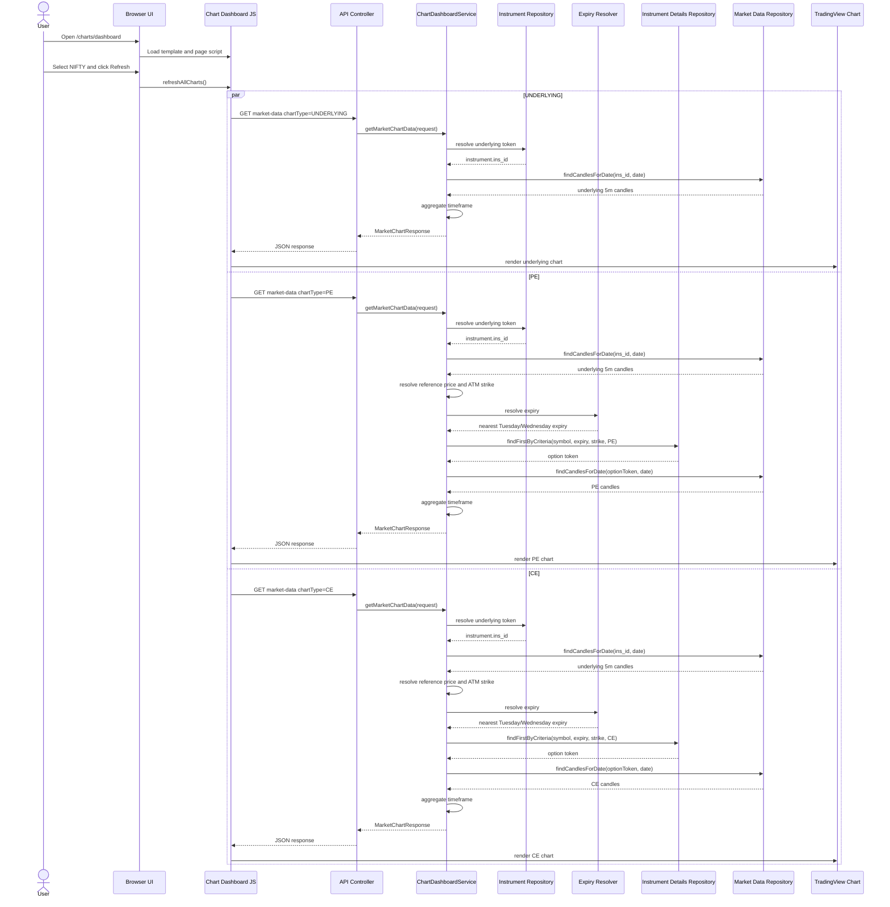

# Chart Dashboard

Technical walkthrough of the Zerodha Kite-style chart dashboard implementation.

Routes:

- Page: `GET /charts/dashboard`
- API: `GET /api/charts/market-data`

---

## Overview

The chart dashboard is a server-rendered Thymeleaf page backed by a REST API.

When the user selects:

- a trading date
- an index: `NIFTY` or `BANKNIFTY`
- one or more timeframes: `5m`, `10m`, `15m`
- one or more SMA periods: `20`, `50`, `100`, `200`, `500`

the frontend requests chart data separately for:

- the underlying index
- the ATM PE option
- the ATM CE option
- two **averaged strike ladders** per side — ATM±1 and ATM±2 — each drawn as one
  synthetic candle series whose OHLC is the mean of the legs

The dashboard supports two data sources:

- `TOKEN_BASED`: existing `market_data` plus token metadata
- `HISTORICAL_ICICI`: imported ICICI CSV data in `historical_spot_candles` and `historical_option_candles`

Both data sources start from 5-minute candles. `10m` and `15m` are aggregated
from those 5-minute rows.

For the historical ICICI storage/import design, see
[`HISTORICAL_CHART_DATA_PLAN.md`](HISTORICAL_CHART_DATA_PLAN.md).

Overlays are computed at runtime by `ChartIndicatorService`, on the **aggregated**
series, using prior-day lookback candles to warm up:

- **Paired SMA over low and high.** Each period yields `sma{N}Low` and
  `sma{N}High` — there is no close-based SMA. The low series is the one the
  trading strategy gates on (`SMAIndicatorImpl` averages candle lows
  deliberately), so the chart and the strategy now agree.
- **SuperTrend(7, 3)** — ATR period 7, band multiplier 3, Wilder-smoothed ATR.
  Emitted as `supertrend` plus a `supertrendUp` direction flag.

> **Order changed:** indicators used to be computed on the 5-minute series and
> then carried through aggregation buckets, which meant "SMA20" on the 15m chart
> was really a 100-minute average. Now the series is aggregated *first* and
> indicators are computed on the bars actually drawn. SuperTrend requires this —
> it is path-dependent (its band ratchets and its direction flips off the previous
> bar) so it cannot be down-sampled after the fact.

---

## Frontend Flow

### Page entry

- `GET /charts/dashboard` is handled by `ChartDashboardViewController`
- the controller returns the Thymeleaf template `chart-dashboard`
- the page HTML lives in `src/main/resources/templates/chart-dashboard.html`

### UI structure

The template contains:

- date picker: `chartDate`
- previous / next / today date shortcuts: `prevDateBtn`, `nextDateBtn`, `todayDateBtn`
- data source dropdown: `chartDataSource`
- index dropdown: `chartIndexSymbol`
- timeframe chip group: `chartTimeframes`
- SMA chip group: `chartSmaPeriods`
- strike select: `chartStrike`
- overlay toggle chips: `chartOverlays` (`SMA High`, `SuperTrend`)
- zoom chip group: `chartZoom` (`1D`, `10D`, `20D`, `Max`)
- refresh button: `refreshChartsBtn`
- fullscreen toggle: `fullscreenChartsBtn`

Eleven panes are rendered across six rows — the index chart spans the full width
on top, then five option rows of two:

- row 1, full width: `underlyingPane` — toolbar timeframe
- row 2: `pePane`, `cePane` — toolbar timeframe
- row 3: `pe15mPane`, `ce15mPane` — **pinned 15m**
- row 4: `pe10mPane`, `ce10mPane` — **pinned 10m**
- row 5: `peAvg3Pane`, `ceAvg3Pane` — **ATM±1 averaged**, toolbar timeframe
- row 6: `peAvg5Pane`, `ceAvg5Pane` — **ATM±2 averaged**, toolbar timeframe

**Pane key ≠ API `chartType`.** The pinned and averaged panes are ordinary PE / CE
requests with one extra dial each, so `PANE_SPEC` maps a pane key to three
things: the `series` that goes on the wire, the `timeframe` to ask at (`null` =
follow the toolbar chip), and the `strikeSpan` to average over (`0` = the plain
contract). `PE_15M` and `PE_AVG3` are dashboard identifiers only — the backend is
asked for `chartType=PE&timeframe=15m` and
`chartType=PE&strikeSpan=1` respectively, and knows nothing about pinning or
about which row a pane sits in.

The 5m/10m/15m chip moves rows 1-2 and 5-6; rows 3-4 hold, which is the point —
three horizons on the same two legs, readable against each other without touching
a control. Rows 5-6 follow the chip rather than pinning because the comparison
they invite is *vertical* at one timeframe: the same instant, the same side, one
contract versus three versus five.

Everything downstream is keyed by pane key and iterates `PANE_KEYS`, and each
pane's element ids are its key's camelCase prefix plus a fixed suffix
(`PE_15M` → `pe15mPaneTitle`, `pe15mChart`, …), so `els.panes` and `getPaneRoot`
derive their lookups instead of listing eleven panes by hand. Note the option
panes have no `…SelectedTimeframe` element — they show Expiry / Strike in the
meta row and carry the timeframe in the badge (and, when pinned, the title).

DOM order matches (underlying, PE, CE) so tab order follows the visual order.
The toolbar is a flex row, not a fixed grid: a fixed `grid-template-columns`
list has to be re-counted whenever a control is added, and adding the strike
picker to a six-track grid pushed Refresh onto its own row and split the SMA
chips over two lines.

Each pane has:

- metadata placeholders
- SMA legend container
- loading state
- error state
- no-data state
- chart container
- zoom controls (`+` / `−`), overlaid bottom-left of the canvas wrap

### JavaScript responsibilities

`src/main/resources/static/js/chart-dashboard.js` handles:

- default control values
- localStorage persistence for the last-used date, source, index, timeframe,
  SMA, strike, overlay toggles, zoom span, and active timeframe
- reading filter values
- reacting to filter changes
- previous / next / today date navigation
- single-select chip timeframes and zoom span, multi-select chip SMA periods and
  overlays
- per-pane strike-ladder width (`PANE_SPEC.strikeSpan`), sent as `strikeSpan`
- refresh button clicks
- keyboard shortcuts for date stepping, refresh, timeframe selection, dismissing
  a pinned readout, and exiting fullscreen mode
- API calls
- loading, error, and no-data states
- TradingView `lightweight-charts` rendering
- per-pane `+` / `−` zoom and Ctrl / Cmd + wheel zoom, mirrored across all
  eleven panes (a plain wheel scrolls the page)
- the `1D` / `10D` / `20D` / `Max` zoom spans, applied to all eleven panes

### What happens when the user selects NIFTY and refreshes

The page state is read from the controls:

- `date`
- `dataSource = HISTORICAL_ICICI` or `TOKEN_BASED`
- `indexSymbol = NIFTY`
- selected timeframes
- selected SMA periods

Then the script triggers three backend fetch groups:

- `chartType=PE`
- `chartType=UNDERLYING`
- `chartType=CE`

For each selected timeframe, one request is sent per chart type.

Example for `date=2024-06-06`, `timeframe=5m`, `smaPeriods=20,50,100,200,500`:

- `GET /api/charts/market-data?date=2024-06-06&dataSource=HISTORICAL_ICICI&indexSymbol=NIFTY&chartType=UNDERLYING&timeframe=5m&smaPeriods=20,50,100,200,500`
- `GET /api/charts/market-data?date=2024-06-06&dataSource=HISTORICAL_ICICI&indexSymbol=NIFTY&chartType=PE&timeframe=5m&smaPeriods=20,50,100,200,500`
- `GET /api/charts/market-data?date=2024-06-06&dataSource=HISTORICAL_ICICI&indexSymbol=NIFTY&chartType=CE&timeframe=5m&smaPeriods=20,50,100,200,500`

**One request per pane, not per chart type.** Timeframes is single-select (see
below), so a refresh issues exactly eleven requests — one per pane:

| Panes | Requests |
|---|---|
| `UNDERLYING` | 1 |
| `PE`, `CE` at the toolbar timeframe | 2 |
| `PE`, `CE` pinned 15m and 10m | 4 |
| `PE`, `CE` averaged ATM±1 and ATM±2 | 4 |

The four averaged panes cost more at the database than their count suggests —
each is a 3- or 5-leg fetch — but each is still **one** HTTP request and, on
`HISTORICAL_ICICI`, **one** query: see
[Averaged strike ladders](#averaged-strike-ladders-atmn-panes).

### Timeframe handling

Responses are stored by chart type and timeframe.

**Timeframes is single-select.** The chip group is bound with
`bindChipGroup(..., { single: true })`, so picking a chip clears its siblings and
re-clicking the active one is a no-op — deliberately, since re-selecting an
unchanged timeframe would otherwise fire a full eleven-request refresh. Each
refresh therefore issues one request per pane rather than one per pane per
timeframe.

Only one timeframe is displayed at a time. There is no per-pane timeframe tab
strip — the toolbar chip group is the only timeframe control. (The strip existed
to switch between several loaded timeframes; single-select left it rendering one
always-active tab, so it was removed along with `renderTimeframeTabs()`.) Each
pane's header badge and its `Timeframe` meta field still show the current
choice.

Keyboard `1` / `2` / `3` select `5m` / `10m` / `15m` outright. (Before the group
became single-select these switched between the several loaded timeframes and
did nothing for one that was not selected.)

Sessions that predate single-select may still hold several values under
`mm.chartDashboard.timeframes`; `hydrateDefaults` keeps only the first so the
toolbar never restores multi-selected.

### SMA handling

The frontend sends the selected SMA list to the backend as `smaPeriods`, but
the backend response still includes all SMA fields.

The selected SMA list is used on the frontend to decide which overlays to draw.
Each period draws **two** lines, in one shared colour:

- `20 -> sma20Low` + `sma20High` — `#2f80ed`
- `50 -> sma50Low` + `sma50High` — `#27ae60`
- `100 -> sma100Low` + `sma100High` — `#f2994a`
- `200 -> sma200Low` + `sma200High` — `#eb5757`
- `500 -> sma500Low` + `sma500High` — `#6c5ce7`

### Overlay toggles

The `chartOverlays` chip group controls what is drawn on top of the candles.
Both chips are on by default, so the untouched chart is unchanged:

- **SMA High** — off hides the `sma{N}High` line of every selected period,
  leaving only `sma{N}Low`. The low line is never toggleable, because it is the
  series the strategy actually gates on. The legend suffix follows the state:
  `SMA 50 H/L` when on, `SMA 50 L` when off.
- **SuperTrend** — off hides both SuperTrend series and drops its legend entry.

Two behaviours differ from the other chip groups and are deliberate:

- The group may be emptied. `bindChipGroup` normally refuses to leave a group
  with nothing selected — meaningless for timeframes or SMA periods — so it
  takes an `allowEmpty` flag, and the overlays group reads through
  `getToggledValues` / `readStoredListAllowEmpty` rather than the helpers that
  substitute defaults for an empty list.
- Toggling redraws from `state.responses` via `renderVisiblePanes` instead of
  going through `refreshAllCharts`. Overlays are a pure render concern and every
  response already carries all the fields, so refetching would fire nine
  identical requests just to hide a line.

SuperTrend is not part of `smaPeriods`. It is drawn the way Kite draws it: **one
band at a time, with a break at every flip.** The band is `#26a69a` while the
trend is up (line under price, "buy") and `#ef5350` while it is down (line over
price, "sell"), matching the candle up/down colours.

`renderSupertrend` builds **two** line series, one per direction, and every bar
belonging to the *other* direction is a real `WhitespaceData` point — a bare
`{ time }`. Two properties fall out of that, and both are required:

- **Exactly one side of price carries a line at any bar.** A bar contributes a
  value to one series and whitespace to the other, so the buy band and the sell
  band can never be drawn over the same candle.
- **The flip is a break, not a segment.** At a flip the band teleports from
  `lower` to `upper` (or back) across roughly six ATRs — a discontinuity, not a
  move the indicator made. Whitespace is the only way to break a line in
  `lightweight-charts`, and whitespace cannot share a timestamp with a value, so
  the break is what forces two series rather than one.

This is `plot(dir > 0 ? st : na, style=linebr)` in Pine terms, which is what Kite
and TradingView render.

> **Two earlier attempts, and what each got wrong.** The original two-series form
> was correct but was read as a bug — "two separate lines at once" is simply what
> a green run followed by a red run looks like — and was replaced by a single
> series using `LineData.color` for per-point colour. A single series *can* change
> colour mid-series, but it cannot carry a break: every consecutive pair of points
> is joined, so each flip rendered as a near-vertical segment running from below
> the candles to above them, putting the indicator on the buy side and the sell
> side at the same time. Dropping the whitespace from the two-series form would
> reintroduce the other failure — each series would join straight across the
> other's stretch and both lines would span the whole chart. The whitespace is
> load-bearing.

The band values themselves were verified against a TradingView `ta.supertrend`
reference (Wilder ATR seeded with the SMA of the first 7 true ranges, band
ratchet on the previous close, flip tested against the active band) over a
400-bar series: zero direction mismatches, zero band mismatches, same flip count.
`ChartIndicatorService` is arithmetically correct — only the plotting was wrong.

The legend matches: **one swatch, coloured by the direction at the right-hand
edge of the chart**, reading `SuperTrend 7,3 · Buy` or `· Sell`. It used to show a
green *and* a red swatch side by side, which misrepresented the indicator — a
SuperTrend reads buy or sell at any one moment and never both, so a two-colour
key described a pair of lines that should not exist. While the ATR is still
warming up there is no reading, and the swatch is muted with no Buy/Sell suffix.
`latestSupertrendDirection` walks back from the newest bar rather than reading
the last element outright, so trailing warm-up or gap bars cannot report "no
signal" on a series that plainly has one.

### Zoom spans

Every response carries the whole continuous window — `CONTINUOUS_LOOKBACK_DAYS`
(45) calendar days back from the selected date — so how much of it is *on screen*
is a separate choice from what was fetched. The `chartZoom` chip group makes that
choice explicit:

| Chip | Window |
|---|---|
| `1D` (default) | the selected session only |
| `10D` | the last **10 trading sessions** ending at the selected date |
| `20D` | the last **20 trading sessions** ending at the selected date |
| `Max` | `fitContent()` — the whole 45-day window |

**Sessions, not calendar days.** Ten calendar days back covers a different number
of trading sessions depending on where the weekends and holidays fall, so a `10D`
measured that way would be a different width every time it was clicked.
`sessionBoundsUpTo` buckets the bars by the `YYYY-MM-DD` prefix of their raw ISO
timestamp — the API already returns `+05:30` times, so a prefix compare is exactly
the market's own session boundary — and `applyZoomWindow` takes the last N of
those buckets. 45 calendar days is roughly 30 sessions, so `20D` always fits
inside the fetched window.

Three properties hold at every span:

- **The window always ends at the selected session.** A chip never silently shows
  a different stretch of history than the date picker says.
- **A missing session falls back to `fitContent()`.** A holiday, or an option leg
  that had not started trading yet, has no bars on the selected date; the whole
  series is a worse view but an honest one, where an empty viewport would look
  broken. `setVisibleRange` throwing (lightweight-charts does not clamp) falls
  back the same way.
- **A short series shows what it has.** A leg with six sessions of data renders
  all six under `10D` rather than refusing to zoom.

Changing the chip **does not refetch and does not redraw** — `onZoomChanged` only
moves the viewport, one step cheaper than the overlay toggles, which at least have
to rebuild the series. `applyZoomToAllPanes` measures each pane against its own
data, exactly as a render does, and holds the `syncingRanges` guard for the whole
loop so the first pane's new range cannot broadcast over the windows the other ten
are about to compute for themselves.

The per-pane `+` / `−` buttons are unchanged and still work on the logical range;
they compose with the chips rather than replacing them.

### Chart rendering

The page uses TradingView `lightweight-charts` from CDN.

Candles are mapped as:

- `time`
- `open`
- `high`
- `low`
- `close`

SMA overlays are mapped to line series. Null SMA values are skipped.

The script also:

- destroys old chart instances before re-rendering
- resizes charts responsively
- falls back to a summary placeholder if chart rendering fails

### Click readout (pinned candle tooltip)

Clicking a candle pins a floating readout inside the pane, driven by
`chart.subscribeClick` in `attachCandleTooltip`:

- candle timestamp (IST, same formatter as the axis labels)
- `O` / `H` / `L` / `C`, with the close tinted green / red by close-vs-open
- absolute and percent change for the candle
- one row per selected SMA period, in the period's line colour:
  `L <sma low>` always, plus `H <sma high>` when the **SMA High** overlay is on
- a SuperTrend row (value + `Buy` / `Sell`, matching the legend) when the
  **SuperTrend** overlay is on

Dismiss a pin by clicking the same candle again, clicking empty plot area, or
pressing `Escape`. Escape is layered: it clears pinned readouts first and only
leaves fullscreen once none are left.

Each pane holds its own pin independently, so an underlying candle and its CE /
PE counterparts at the same timestamp can be read side by side.

The values come from the API payload looked up by click time, not from
`param.seriesData`. `seriesData` only carries series that were actually drawn,
so the SMA-high figures would disappear from the readout whenever the overlay
is off — but those are exactly the numbers worth reading.

The tooltip is `pointer-events: none`, so a pin sitting over the chart does not
block the click that would replace it, and it flips to the other side of the
click point near a pane edge because `.chart-canvas` clips its overflow. No
teardown hook is needed: the tooltip node is a child of the container
`renderChart` wipes, and the click subscription dies with the chart.

### UI states

Per pane:

- loading is shown while requests are in flight
- error is shown if the request fails
- no-data is shown if the API returns an empty `data` array

---

## Backend API Flow

### Controller

`GET /api/charts/market-data` is handled by:

- `src/main/java/com/moneymaker/chart/controller/ChartDashboardApiController.java`

### Request parameter mapping

The controller receives:

- `date`
- `dataSource`
- `indexSymbol`
- `chartType`
- `timeframe`
- `smaPeriods`
- `strike` (optional)
- `strikeSpan` (optional, defaults to `0`)

It converts them into `MarketChartRequest`:

- `date -> LocalDate`
- `dataSource -> ChartDataSource`
- `indexSymbol -> IndexSymbol`
- `chartType -> ChartType`
- `timeframe -> ChartTimeframe`
- `smaPeriods -> List<Integer>`
- `strike -> BigDecimal` (blank or `AUTO` becomes `null`)
- `strikeSpan -> int` (`0` charts the single strike)

### Strike selection

`strike` is optional. When absent the service resolves ATM from the day's
underlying price exactly as before, so the default behaviour is unchanged; when
present it charts that strike instead. `MarketChartResponse.atmStrike` always
reports the strike actually plotted, and the option pane headings switch from
`ATM PE` / `ATM CE` to `PE <strike>` / `CE <strike>` once a strike is picked.

`GET /api/charts/strikes?date=&indexSymbol=&chartType=&dataSource=` backs the
picker, returning `{expiryDate, atmStrike, strikes}`. The strikes come from the
same table the candles come from — `historical_option_candles` for
HISTORICAL_ICICI, `instrument_details` for TOKEN_BASED — so the picker can only
ever offer a strike that actually renders.

### Averaged strike ladders (ATM±N panes)

`strikeSpan` widens a request from one contract to a ladder centred on the strike
it would otherwise have charted, and returns **one synthetic candle series** whose
OHLC is the mean of the legs bar for bar:

| `strikeSpan` | Legs | Panes |
|---|---|---|
| `0` (default) | the strike alone | every pane in rows 1-4 |
| `1` | ATM−1, ATM, ATM+1 | `peAvg3Pane`, `ceAvg3Pane` |
| `2` | ATM−2 … ATM+2 | `peAvg5Pane`, `ceAvg5Pane` |

**Why average at all.** A single option's premium is noisy, and it steps as the
underlying walks across the strike grid — a move that is really about *which side
of 24500 spot is on* shows up as a jump in a series that is supposed to be about
direction. The mean of a ladder straddling the money moves with the underlying
instead, so the SMAs over it are a much quieter read. Note this is the average of
the **strike ladder**, not of CE and PE: PE and CE keep their own panes, and each
side gets its own averaged pair.

**±1 is one step of the index's grid**, not one row of whatever strikes happen to
be imported — 50 for NIFTY, 100 for BANKNIFTY. `ChartStrikeLadder` owns that step
and now also owns the ATM rounding both chart services used to do for themselves,
so "round to ATM" and "one strike up" cannot drift apart. An ATM rounded on a
50-point grid with a ladder stepped by 100 would centre the average somewhere the
underlying never was.

**The ladder straddles the money for either right.** For a CE the lower legs are
ITM and the upper OTM; for a PE it is the reverse. Because the span is symmetric,
the same count sits either side whichever right is charted, which is what lets the
PE and CE panes in a row be read against each other.

**Every leg must be present, or the bar is dropped.** `ChartStrikeAverager` emits a
timestamp only when *all* legs have a candle for it. Averaging whichever legs
happen to be there would keep the series unbroken at the cost of changing what a
bar means from bar to bar — the mean of five premiums sits well below the mean of
the three innermost, so a leg appearing or disappearing steps the whole level and
drags an SMA through it. That is a crossover the market never printed; a gap is
honest, a step is not. The consequence worth knowing is that an illiquid outer leg
shortens the series, and a leg with no candles at all in the window empties it.

**`averagedStrikes` reports what was really averaged**, not what was asked for. A
leg with no candles drops out, so an "ATM±2" pane can be drawing three contracts;
the Strike meta cell shows the range and the count (`24400-24600 (avg of 5)`) so
that discrepancy is visible rather than implied by the heading.

**The synthetic bar is always a valid candle.** Each leg satisfies
`low <= open,close <= high`, and the mean preserves every one of those
inequalities, so the pane can never render an inverted bar however far apart the
legs' premiums are.

**Averaging happens before aggregation and before indicators.** The order is
average → aggregate to the timeframe → compute overlays → trim to the window, so
the SMAs and SuperTrend are computed on the bars actually drawn, exactly as for a
single-strike series. The averager deliberately leaves every overlay field null.

**Cost.** On `HISTORICAL_ICICI` a ladder is **one** query —
`findRecentCandlesUpToForStrikes` uses `strike_price IN (…)`, which the
`uk_historical_option_series_time` index serves as a handful of range dives — with
the page sized for the whole ladder, since the `LIMIT` is over the union of the
legs rather than per leg. `TOKEN_BASED` is inherently per-strike: each leg needs
its own `instrument_details` token before `market_data` can be queried, so it
issues one lookup and one fetch per leg.

> `strike_price` is `DECIMAL(12,4)` and reads back as `24450.0000`, while the
> ladder carries a plain `24450`. Those are not `BigDecimal.equals`-equal, so the
> service keys its legs in a `TreeMap` (which compares numerically) and
> `HistoricalOptionCandleStrikeLadderQueryTest` pins that the SQL `IN` compares
> numerically too. Get either wrong and every averaged pane returns empty and
> looks like missing data.

`strikeSpan` is capped at `MAX_STRIKE_SPAN` (5) in `ChartDashboardService`, so a
hand-written URL cannot turn one pane into a hundred-leg fetch. The dashboard only
ever asks for 1 and 2.

### DTOs used

- `MarketChartRequest`
- `MarketChartResponse`
- `ChartCandleResponse`
- `ChartType`
- `IndexSymbol`
- `ChartTimeframe`

### Validation

`ChartDashboardService` validates:

- request is present
- `date` is present
- `indexSymbol` is present
- `chartType` is present
- `timeframe` is present
- `smaPeriods` is present
- all SMA periods are from `20,50,100,200,500`
- `strikeSpan` is between `0` and `MAX_STRIKE_SPAN` (5)

### Response behavior

Success:

- HTTP `200`
- `MarketChartResponse` — `atmStrike` is the strike actually plotted (the ladder's
  centre on an averaged request), and `averagedStrikes` lists the legs that were
  averaged, empty for an ordinary single-strike series

No data:

- HTTP `200`
- same response shape
- `data: []`

Invalid request:

- HTTP `400`
- body like `{ "error": "..." }`

---

## Underlying Chart Flow

When `chartType = UNDERLYING`:

1. resolve the underlying instrument from `instrument`
2. read the underlying token from `instrument.ins_id`
3. query `market_data` for that token and selected date
4. map each `MarketData` row to `ChartCandleResponse` (OHLC only)
5. apply timeframe aggregation over the whole lookback window
6. compute overlays on the aggregated series (`ChartIndicatorService`)
7. trim to the selected date and return `MarketChartResponse`

### Underlying token resolution

Repository:

- `InstrumentRepository`

Lookup order:

1. exact `ins_name = NIFTY` or `BANKNIFTY`
2. fallback prefix match like `NIFTY%` or `BANKNIFTY%`

Fields used from `instrument`:

- `ins_name`
- `ins_id`

### Candle query

Repository:

- `MarketDataRepository.findCandlesForDate(instrumentToken, tradingDate)`

Query rules:

- `instrumenttoken = :instrumentToken`
- `DATE(timestamp) = :tradingDate`
- ordered by `timestamp ASC`

### Timeframe behavior

- `5m`: returned as-is after sort
- `10m`: 10-minute buckets anchored on the 09:15 session open
- `15m`: 15-minute buckets anchored on the 09:15 session open

Aggregation rules:

- open = first candle open
- high = max high
- low = min low
- close = last candle close
- no indicator values are read or carried — overlays are computed afterwards

Buckets are keyed on `(trading date, elapsed minutes since the session open)`,
not on list position. Position-based chunking breaks once the input spans more
than one day: an NSE session is 75 five-minute candles, which is not divisible
by 2, so 10-minute buckets drift and eventually merge one day's last candle with
the next day's first. It also shifts every later bar whenever an illiquid option
series has a gap. Anchoring on the open puts boundaries where a broker puts them
(09:15, 09:30, …), and pre-open candles — the ICICI spot exports carry flat
09:05/09:10 rows — land in their own bucket instead of polluting the first
session bar.

### Indicator mapping

Computed by `ChartIndicatorService` on the aggregated series:

- `sma{N}Low` — mean of the last `N` candle **lows**
- `sma{N}High` — mean of the last `N` candle **highs**
- `supertrend` / `supertrendUp` — SuperTrend with ATR period `7` and multiplier
  `3`; ATR uses Wilder smoothing seeded from a simple mean of the first 7 true
  ranges, and the bands ratchet in the standard way

All are `null` until the relevant window warms up, which is why the lookback
candles are aggregated and fed through before the visible day is trimmed out.

Lookback candles from prior trading dates are included so the selected day can
show SMA values from its opening candles when enough history exists.

### Response

For underlying charts:

- `expiryDate = null`
- `atmStrike = null`

The logic is the same for `NIFTY` and `BANKNIFTY`; only the underlying
instrument lookup label differs.

---

## ATM PE and ATM CE Flow

When `chartType = PE` or `chartType = CE`:

1. resolve the underlying token
2. fetch underlying 5-minute candles for the selected date
3. choose a reference price
4. calculate the ATM strike
5. resolve the weekly expiry
6. build the strike ladder — the strike alone unless `strikeSpan > 0`
7. per leg: resolve the option token from `instrument_details`, then fetch its
   candles from `market_data`. A leg with no token or no candles is skipped, and
   narrows the average rather than failing the request
8. average the legs into one series (a one-leg ladder passes straight through, so
   the ordinary chart has no separate code path to drift from)
9. aggregate by requested timeframe
10. compute overlays on the aggregated series
11. return chart data

### Reference price

The service chooses:

1. the first available candle close at or after market open (`09:15`)
2. if unavailable, the first non-null close for that date

### ATM strike

- `NIFTY -> nearest 50`
- `BANKNIFTY -> nearest 100`

### Expiry resolution

Table:

- `expiry_dates`

Current resolver behavior:

- reads all expiry rows where `expiry_date >= selectedDate`
- filters in memory by weekday

Rules:

- `NIFTY -> Tuesday`
- `BANKNIFTY -> Wednesday`

Nearest matching expiry is returned.

### Option token resolution

Table:

- `instrument_details`

Repository criteria:

- trading symbol starts with selected index symbol
- `expiry = resolved expiry date`
- `strike = atmStrike`
- `instrument_type = CE` or `PE`

Fields required:

- `tradingsymbol`
- `expiry`
- `strike`
- `instrument_type`
- `instrument_token`

`name` exists in the entity but is not used by the chart flow.

### Option candle fetch

After token resolution, the option token is queried in `market_data` using the
same date filter as the underlying chart.

### Missing-data behavior

If underlying token is missing:

- return safe empty response

If underlying candles are missing:

- return safe empty response

If reference price cannot be found:

- return safe empty response

If expiry is missing:

- return safe empty response
- include `atmStrike` if it was calculated

If option token is missing:

- return safe empty response
- include `expiryDate` and `atmStrike`

If option candles are missing:

- return response with `data: []`

The only logic difference between `NIFTY` and `BANKNIFTY` is:

- ATM rounding step
- expiry weekday

---

## Required Tables

| Table | Purpose | Required columns | Used for | If missing |
|---|---|---|---|---|
| `market_data` | stores 5-minute candles | `instrumenttoken`, `timestamp`, `open`, `high`, `low`, `close` | UNDERLYING, PE, CE | chart returns empty data |
| `instrument` | resolves underlying token | `ins_name`, `ins_id` | UNDERLYING, PE, CE | underlying and option flows cannot start |
| `instrument_details` | resolves CE/PE option token | `tradingsymbol`, `expiry`, `strike`, `instrument_type`, `instrument_token` | PE, CE | option flow returns empty data |
| `expiry_dates` | resolves nearest weekly expiry | `expiry_date` | PE, CE | option flow returns empty data |

### market_data

This table stores 5-minute base candle data.

Columns used by the dashboard:

- `id`
- `close`
- `high`
- `instrumenttoken`
- `low`
- `open`
- `timestamp`

The table may also contain `sma_value20`, `sma_value50`, `sma_value100`,
`sma_value200`, and `sma_value500`, but the chart dashboard does not rely on
those stored values for plotting. It computes SMA at runtime from candle close
prices.

### instrument

Used to resolve the underlying token for:

- `NIFTY`
- `BANKNIFTY`

Current code uses:

- `ins_name`
- `ins_id`

### instrument_details

Used to resolve the ATM option token for:

- CE
- PE

Current code uses:

- `tradingsymbol`
- `expiry`
- `strike`
- `instrument_type`
- `instrument_token`

### expiry_dates

Used to find the nearest valid weekly expiry date.

Current chart resolver uses:

- `expiry_date`

The entity also has `instrument_id`, but the current chart resolver does not
use it yet.

---

## Example End-to-End Flow

Example user selection:

- `date = 2024-06-06`
- `indexSymbol = NIFTY`
- `timeframe = 5m`
- `smaPeriods = 20,50,100,200,500`

Flow:

1. frontend sends UNDERLYING request
2. backend resolves NIFTY underlying token from `instrument`
3. backend fetches NIFTY 5-minute candles from `market_data`
4. backend returns underlying candles
5. frontend sends PE request
6. backend resolves NIFTY underlying token
7. backend fetches underlying candles again
8. backend uses the first close at or after `09:15`
9. backend calculates NIFTY ATM strike using nearest `50`
10. backend resolves the nearest Tuesday expiry from `expiry_dates`
11. backend resolves the PE token from `instrument_details`
12. backend fetches PE candles from `market_data`
13. backend returns PE chart data
14. frontend sends CE request
15. backend resolves the CE token from `instrument_details`
16. backend fetches CE candles from `market_data`
17. backend returns CE chart data
18. frontend renders:
    - row 1 = NIFTY (full width)
    - row 2 left = ATM PE
    - row 2 right = ATM CE

---

## Sequence Diagram

---

## Missing Data Checklist

- `instrument` contains valid underlying rows for `NIFTY` and `BANKNIFTY`
- `instrument.ins_id` matches `market_data.instrumenttoken` for underlying rows
- `expiry_dates` contains required Tuesday and Wednesday expiries
- `instrument_details` contains CE/PE rows with matching:
  - symbol prefix
  - expiry
  - strike
  - option type
  - instrument token
- `market_data` contains 5-minute candles for:
  - underlying token
  - PE token
  - CE token
- enough historical 5-minute candles exist before the selected date so larger
  SMA periods such as `200` and `500` can be computed from lookback history

---

## Debugging Guide

If a pane shows no data, check:

1. does `market_data` contain rows for the selected date
2. does the UNDERLYING API call return candles
3. does `instrument` resolve the underlying token
4. does `expiry_dates` contain the nearest valid weekly expiry
5. does the calculated ATM strike match `instrument_details.strike`
6. does `instrument_details` contain the CE/PE token
7. does `market_data` contain CE/PE candles for that token
8. is the frontend sending `date` as `yyyy-MM-dd`
9. are there browser console errors
10. did the TradingView `lightweight-charts` CDN load successfully

If only an **averaged** pane is empty while the single-strike pane beside it
draws, the ladder is the difference — check in this order:

11. do the neighbouring strikes exist for that expiry at all (the strike picker
    lists exactly what is chartable)
12. does one leg have a *shorter* history than the others — the all-legs rule
    trims the series to the intersection, so one illiquid outer strike shortens
    every bar it is missing from
13. what does `averagedStrikes` say in the response — it names the legs that
    actually contributed, and the pane's Strike meta cell shows the same
14. on `TOKEN_BASED`, does `instrument_details` carry a token for each leg — a
    leg with no token is skipped silently and simply narrows the average

---

## Current Notes

- The backend API is safe by default: missing lookup data returns empty results
  instead of throwing a chart-breaking error.
- `expiry_dates.instrument_id` exists in the entity, but the current chart
  expiry resolver uses weekday filtering on `expiry_date` only.

---

## Continuous (multi-day) charts

`MarketChartRequest.fromDate` draws one continuous series across
`[fromDate, date]` instead of a single day. Absent, the API keeps the
original single-day behaviour. The API contract is unchanged and still takes an
arbitrary `fromDate`.

**The dashboard has no control for this — it is always continuous.** Every
request the page makes carries `fromDate = Date − 45 days`
(`CONTINUOUS_LOOKBACK_DAYS` in `chart-dashboard.js`), so the chart is always one
series running through session boundaries, and the toolbar carries neither a
from-date picker nor a mode toggle. Both existed briefly and were removed: the
window was not a decision anyone was making per chart, and fixing it also
removes the inverted-range case the picker had to guard (a From after the To
came back as a silently empty chart).

**The viewport still opens on the selected day.** Fetching 45 days is not the
same as showing 45 days: `applyZoomWindow` sets the visible range to the
selected date's own session (~78 five-minute bars) and leaves the remaining
~2,400 bars off-screen to the left, one drag away. The window is there to warm
the SMAs and put the recent past within scrolling reach — fitting all of it would
squeeze the day you actually selected into a few pixels. `1D` is only the
*default*; the [zoom chips](#zoom-spans) widen the viewport to 10 or 20 sessions,
or to the whole window, without changing what was fetched.

The session is matched on the raw ISO string's date prefix rather than by
converting epoch seconds back to a calendar day: the API already returns
`+05:30` timestamps, so a prefix compare *is* the market's session boundary and
needs no timezone arithmetic to get wrong. When the selected date has no bars in
a given series — a holiday, or an option leg that had not started trading yet —
that pane falls back to `fitContent()`; the whole window is a worse view but an
honest one, where an empty viewport would look broken.

Resizing and the fullscreen toggle preserve the visible logical range rather than
re-fitting, so the same bars stay on screen and simply get more room. They used
to call `fitContent()`, which threw away both the session focus and wherever the
user had scrolled to.

Each pane carries its own `+` / `−` buttons, overlaid bottom-left so they clear
lightweight-charts' price scale on the right and its time axis underneath. They
step the **visible logical range** (bar indices) rather than `barSpacing`, so
they speak the same units as `applyZoomWindow` and the resize handler and
compose with both. The two factors are exact inverses (`0.8` and `1.25`), so
zooming in and back out returns to the range you started from instead of
drifting, and the step is centred on what is on screen rather than the right
edge — the buttons sit next to a chart the user has usually already scrolled to
a particular bar. The visible span is clamped to `[5, 20000]` bars; without the
floor, repeated `+` eventually asks for a zero-width range and the pane goes
blank with no way back short of a reload.

The buttons live on `.chart-canvas-wrap`, **not** `.chart-canvas` — the renderer
clears the canvas element's `innerHTML` before creating the chart, so anything
parked inside it disappears on the first refresh.

### The wheel scrolls the page; Ctrl + wheel zooms

`handleScale.mouseWheel` is **false** in `createPaneChart`. It used to be true,
which made a plain wheel zoom the pane under the pointer — and because
lightweight-charts calls `preventDefault()` on every wheel event it consumes, the
page could not be scrolled at all while the pointer was over a chart. With eleven
stacked panes the pointer is over a chart almost everywhere, so scrolling down the
dashboard zoomed a chart instead of moving the page.

The internals make the fix exact rather than approximate: lightweight-charts
returns early — before `preventDefault()` — when the wheel's `deltaX` is 0 *and*
the scale handler is off, which is precisely a vertical-only wheel. So the page
gets its scroll back while `handleScroll.mouseWheel` stays true and a horizontal
trackpad swipe still pans the series, a gesture the page has no other use for.

Wheel-zoom is not lost, it is behind a modifier. A delegated `wheel` listener
(registered `passive: false`, since it must be allowed to `preventDefault`) zooms
the pane under the pointer on **Ctrl / Cmd + wheel**, resolving the pane by
walking up from the event target with `paneKeyAt` — the wheel lands on whichever
canvas or overlay lightweight-charts has under the cursor, several levels below
the container this code named. Browsers also deliver a trackpad pinch as
Ctrl + wheel, so pinch-to-zoom over a pane works through the same path.

The remaining ways to change the window are unchanged: the `+` / `−` buttons, a
drag, and the `1D` / `10D` / `20D` / `Max` chips.

### Zoom is synced across panes

Moving one pane's window — the `+` / `−` buttons, Ctrl + wheel, a drag — moves all
ten, via `subscribeVisibleTimeRangeChange` on each chart broadcasting to the
others behind a `syncingRanges` re-entry guard.

The broadcast carries a **time range, not a logical range**, and that distinction
is load-bearing now that the panes no longer share a timeframe: bar 40 of a
5-minute series and bar 40 of a 15-minute series are three quarters of an hour
apart, so mirroring bar indices would drift the pinned rows out of alignment with
the top ones. Wall-clock times mean the same instant on every pane whatever its
bucket size.

Each `setVisibleRange` is individually guarded, because a window can fall
entirely outside one pane's data — an option leg that had not started trading
yet — and lightweight-charts throws rather than clamping. One pane refusing a
window must not stop the other six from following.

Consequences worth knowing:

- **Single-day is no longer reachable from the dashboard.** The API path is
  unchanged and still draws one day when `fromDate` is absent — it is simply not
  something this page asks for any more.
- **Deep links get the window too.** The orders-ledger *Chart* button links with
  the trade's `date`, which now opens the 45 days ending on that day rather than
  the day alone. The trade's own session is the right-hand edge of the chart.
- **Nothing about it is remembered**, because there is nothing to remember. The
  page actively clears the two keys earlier versions wrote
  (`mm.chartDashboard.continuous` and `mm.chartDashboard.fromDate`) so returning
  browsers do not carry dead entries.

Two things worth knowing:

- **The candle page size scales with the window.** It was a fixed
  `MAX_SMA_PERIOD + LOOKBACK_BUFFER_CANDLES` = 596 candles, sized for one day -
  about **eight sessions** of 5-minute data. A longer range would have silently
  started partway through. `pageSizeFor(from, to)` now adds the window itself,
  capped at `MAX_WINDOW_DAYS` (90) so an accidental multi-year range cannot stall
  the page.
- **`TOKEN_BASED` ignores `fromDate`.** Continuous charts are `HISTORICAL_ICICI`
  only. The token-based service was left alone rather than half-wired.

A continuous **option** chart stops where that contract stops: expiry and strike
are resolved from the selected date, and a series spanning an expiry shows only
the days this contract traded rather than splicing in a different one.

## Opening the chart for a trade

Each Orders-ledger row carries a **Chart** link to
`/charts/dashboard?date=…&indexSymbol=…&strike=…&dataSource=HISTORICAL_ICICI`.

`hydrateDefaults()` lets query-string values **win over localStorage**. That
ordering is the whole point: without it the dashboard would restore whatever the
last manual session left behind and quietly show the wrong day for the trade you
clicked.
